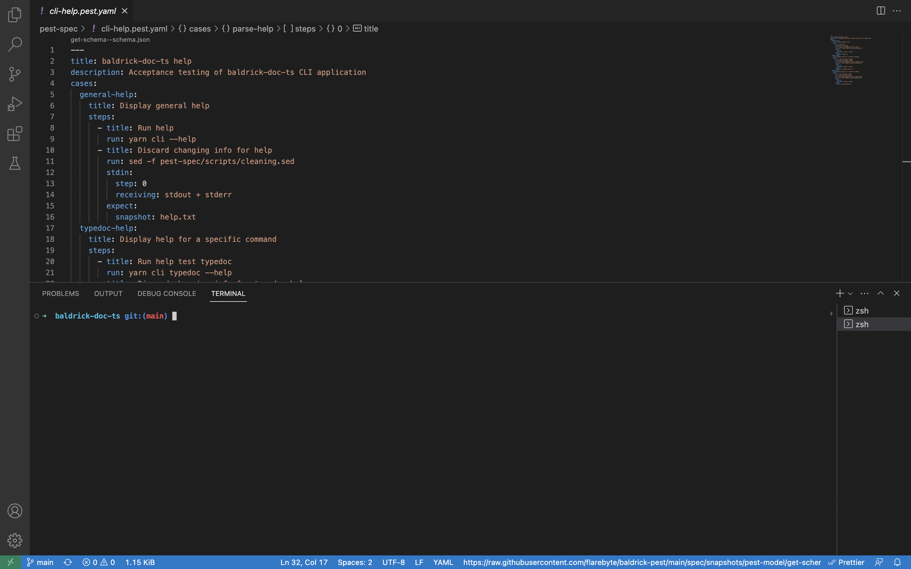

# baldrick-pest

 


> Cunning regression tests for CLI applications

Run some


Highlights:

-   Test any kind of executable regardless of the programming language it
    has been created with.
-   Tests are written in YAML with a json schema.
-   Regression are checked by making snapshots.
-   Writing tests is quick and easy with auto-completion in vs-code
-   Reports the test results in mocha json.
    This makes it easy to integrate with other tools and services that use mocha json as a standard format for test results.



## Documentation and links

-   [Code Maintenance](MAINTENANCE.md)
-   [Code Of Conduct](CODE_OF_CONDUCT.md)
-   [Api for baldrick-pest](API.md)
-   [Contributing](CONTRIBUTING.md)
-   [Glossary](GLOSSARY.md)
-   [Diagram for the code base](INTERNAL.md)
-   [Vocabulary used in the code base](CODE_VOCABULARY.md)
-   [Architectural Decision Records](DECISIONS.md)
-   [Contributors](https://github.com/flarebyte/baldrick-pest/graphs/contributors)
-   [Dependencies](https://github.com/flarebyte/baldrick-pest/network/dependencies)
-   [Usage ★★](USAGE.md)
-   [Overview for the json schema for baldrick pest yaml file](SCHEMA.md)
-   [Json schema for baldrick pest yaml
    file](spec/snapshots/build-model/get-schema--schema.json)

## Related

-   [baldrick-zest-engine](https://github.com/flarebyte/baldrick-zest-engine)
    Run tests declaratively with a few cunning plans
-   [assert sh](https://github.com/lehmannro/assert.sh) test-driven
    development for bash
-   [bash\_unit](https://github.com/pgrange/bash_unit) bash unit testing
    enterprise edition framework
-   [shUnit2](https://github.com/kward/shunit2) unit test framework for
    Bourne based shell scripts

## Installation

This package is [ESM
only](https://blog.sindresorhus.com/get-ready-for-esm-aa53530b3f77).

```bash
yarn global add baldrick-pest
baldrick-pest --help
```

Or alternatively run it:

```bash
npx baldrick-pest --help
```

If you want to tun the latest version from github. Mostly useful for dev:

```bash
git clone git@github.com:flarebyte/baldrick-pest.git
yarn global add `pwd`
```
