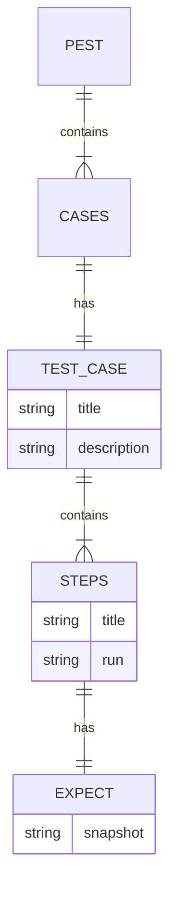
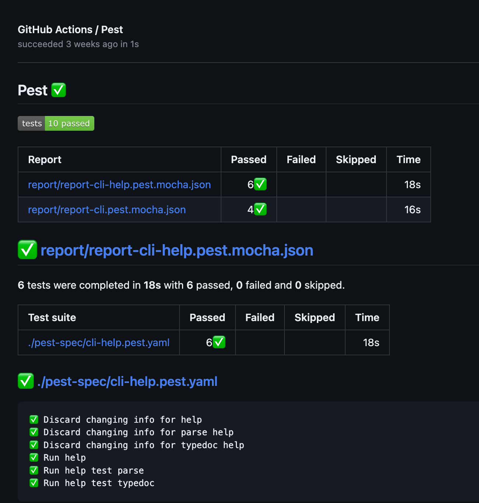

# Usage

## Overview

A `baldrick-pest` YAML file describes test cases for a command line interface
(CLI) program. The file has several keys: `title`, `description`, and
`cases`. The `title` key provides the name of the test, while the
`description` key gives a brief explanation of what the test is for. The
`cases` key contains a list of test cases, each with its own set of keys. In
the following example, there is one test case with the key `cat`. This test
case has its own title and a list of steps to be performed. Each step has its
own title, a run command to execute, and an expect key that specifies what
the expected outcome of the step should be.



Example:

```yaml
title: baldrick-pest
description: Test of baldrick-pest CLI
cases:
  cat:
    title: Simple cat is captured
    steps:
      - title: Read license file
        run: cat LICENSE
        expect:
          snapshot: license.txt
          # Optional normalization: ignore trailing blank lines/newlines at EOF
          # during comparison to avoid false diffs on whitespace-only changes.
          # Default: false (no normalization)
          ignoreTrailingBlankLines: true
```

## Cases

A case represents a test case for a command line interface (CLI) program. A
test case is a set of conditions under which a tester will determine whether
the system under test satisfies requirements.

| Name          | Type   | Description                                                             |
| ------------- | ------ | ----------------------------------------------------------------------- |
| cases         | object | A collection of test cases                                              |
| name          | string | The unique identifier for the test case                                 |
| title         | string | A brief summary of the test case                                        |
| description   | string | A detailed explanation of the purpose of the test case                  |
| motivation    | string | The reason why this test case is necessary                              |
| todo          | string | A description of any tasks that need to be completed for this test case |
| links         | array  | A list of relevant links related to the test case                       |
| title (links) | string | The title of the linked resource                                        |
| url (links)   | string | The URL of the linked resource                                          |

This is a YAML script that defines a todo test case.
TODO is a feature that allows you to create a test placeholder as a way to
plan and keep track of what you want to test in the future. It’s a way to
take note of tests that need to be written without actually writing them yet.

```yaml
todo:
  title: Todo use case
  todo: Description of future implementation
  steps: []
```

## Steps

A step represents a single step in a test case for a command line interface
(CLI) program. Each step has several keys that provide information about the
step, such as its title, description, and motivation.

| Name                | Type    | Description                                                                          |
| ------------------- | ------- | ------------------------------------------------------------------------------------ |
| steps               | array   | A list of steps in a test case                                                       |
| title (steps)       | string  | A brief summary of the step                                                          |
| description (steps) | string  | A detailed explanation of the purpose of the step                                    |
| motivation (steps)  | string  | The reason why this step is necessary                                                |
| links (steps)       | array   | A list of relevant links related to the step                                         |
| title (links)       | string  | The title of the linked resource                                                     |
| url (links)         | string  | The URL of the linked resource                                                       |
| stdin (steps)       | object  | Specifies input to be passed to the `run` command from the output of another step    |
| step (stdin)        | integer | The index of the step whose output should be used as input                           |
| exitCode (stdin)    | string  | The expected exit code of the `run` command                                          |
| receiving (stdin)   | string  | The method by which input is passed to the `run` command                             |
| run (steps)         | string  | The shell command to execute for this step                                           |
| expect (steps)      | object  | The expected outcome of the step                                                     |
| exitCode (expect)   | string  | The expected exit code of the `run` command                                          |
| capture (expect)    | string  | The expected output of the `run` command                                             |
| snapshot (expect)   | string  | A short name used as part of a file name for storing the output of the `run` command |
| ignoreTrailingBlankLines (expect) | boolean | Normalize both actual and expected by trimming trailing blank lines and enforcing one final newline |

Example:

```yaml
just-check-exit:
  title: Just check the exit code
  steps:
    - title: Check a file that does not exist
      run: ls this-file-does-not-exist.txt
      expect:
        exitCode: exit 1 .. n
    - title: simple display
      run: echo "end of just-check-exit"
      expect:
        exitCode: any
```

The test case has two steps. The first step checks for the existence of a
file named `this-file-does-not-exist.txt` using the ls command. The expected
exit code for this step is any value between 1 and n. The second step simply
displays the text “end of just-check-exit” using the `echo` command. The
expected exit code for this step can be any value.

Another YAML script that defines a test case for counting the number of lines
in a file:

```yaml
count:
  title: Pipe using stdin
  steps:
    - title: Read license file
      run: cat LICENSE
      expect:
        exitCode: exit 0
    - title: Count lines
      run: wc -l
      stdin:
        step: 0
      expect:
        snapshot: lines.txt
```

The test case has two steps. The first step reads the content of a file named
LICENSE using the cat command. The expected exit code for this step is 0. The
second step counts the number of lines in the input received from the first
step using the wc -l command. The input for this step is specified using the
stdin key and is set to the output of the first step. The expected output for
this step is specified using the snapshot key and is set to the content of a
file named `lines.txt`.

## CLI

You can use baldrick-pest CLI to run shell regression tests on my\_program and
ensure that it is functioning as expected. Here's an example command:

```bash
npx baldrick-pest@latest test --spec-file pest-spec/my_program.pest.yaml
```

The test command runs regression tests and takes several options to specify
the test file, directory location, and report preferences.

```bash
Usage: baldrick-pest test [options]

Run regression test

Options:
  - f, --spec-file <filename>         Test file in baldrick-pest YAML
format (default: "pest-spec/index.pest.yaml")
  - dir, --spec-dir <directory>       Directory with the pest spec files
(default: "pest-spec")
  - rep, --report-dir <directory>     Directory for the reports (default:
"report")
  - snap, --snapshot-dir <directory>  Directory for the snapshots (default:
"pest-spec/snapshots")
  - mocha, --mocha-json-report        Enable mocha reports (default: true)
  - h, --help                         display help for command
```

To run the test command with additional options, use the following usage
guide:

```bash
Usage: baldrick-pest [options] [command]

CLI to run shell regression tests

Options:
  - V, --version   output the version number
  - h, --help      display help for command

Commands:
  test [options]  Run regression test
  help [command]  display help for command
```

Use these commands and options to ensure that your program is working
properly and to quickly identify any potential issues.

## Github action

This is a GitHub Actions workflow file written in YAML for reporting the
results of the baldrick-pest tests. It specifies a continuous integration
(CI) workflow that runs when code is pushed to the repository. The workflow
has one job named build that runs on both macOS and Ubuntu operating systems
using Node version `22.x`. The job checks out the repository, runs pest
integration tests if the pest-spec directory exists, and generates a test
report using the
[dorny/test-reporter](https://github.com/dorny/test-reporter) action.

```yaml
name: CI
on:
  - push
jobs:
  build:
    name: Build, lint, and test on Node ${{ matrix.node }} and ${{ matrix.os }}
    runs-on: ${{ matrix.os }}
    strategy:
      matrix:
        node:
          - 22.x
        os:
          - macOS-latest
          - ubuntu-latest
    steps:
      - name: Checkout repo
        uses: actions/checkout@v3
      - name: Run pest integration tests
        run: |
          if [ -d "pest-spec" ]; then
            npx npx baldrick-broth@latest test pest
          else
            echo "No pest files. Skipping"
          fi
      - name: Test Report
        uses: dorny/test-reporter@v1
        if: success() || failure()
        with:
          name: Pest
          path: report/*.pest.mocha.json
          reporter: mocha-json
```



## Visual Studio code

[YAML Language Support by Red
Hat](https://marketplace.visualstudio.com/items?itemName=redhat.vscode-yaml)
is an extension that provides comprehensive YAML language support to Visual
Studio Code, via the yaml-language-server.

It uses JSON Schemas to understand the shape of a YAML file, including its
value sets, defaults and descriptions.
It offers features such as YAML validation, document outlining, auto
completion, hover support and formatter.
Auto completion and hover support are provided by the schema, so if a json
schema exists for a YAML file, the extension can suggest possible values and
show descriptions for each node.

You can set it up for `baldrick-pest` by adding the following code in your
visual code studio settings:

```json
"yaml.schemas": {
     "https://raw.githubusercontent.com/flarebyte/baldrick-pest/main/spec/snapshots/pest-model/get-schema--schema.json": "*.pest.yaml"
}
```
